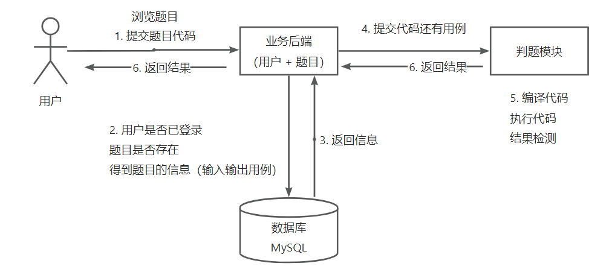
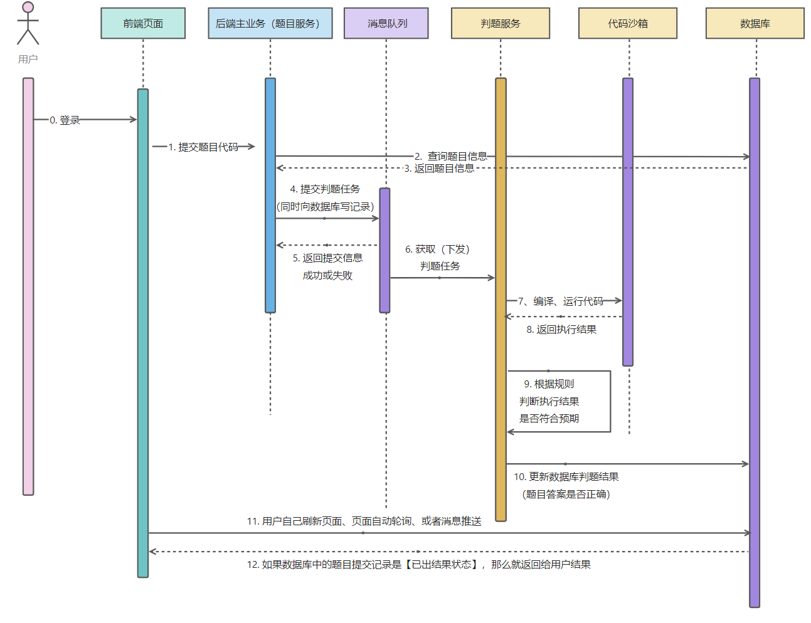
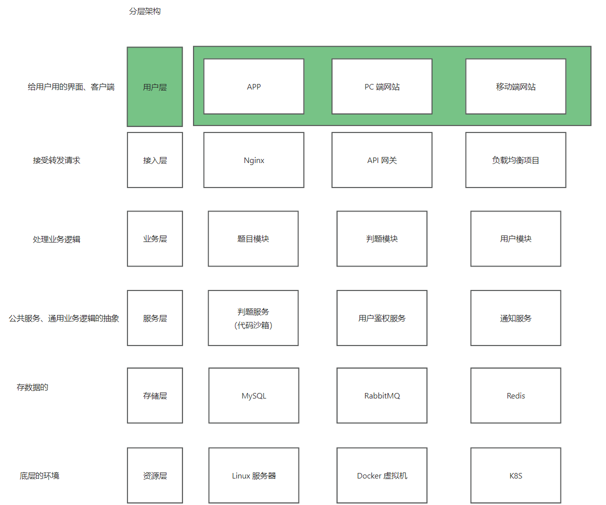
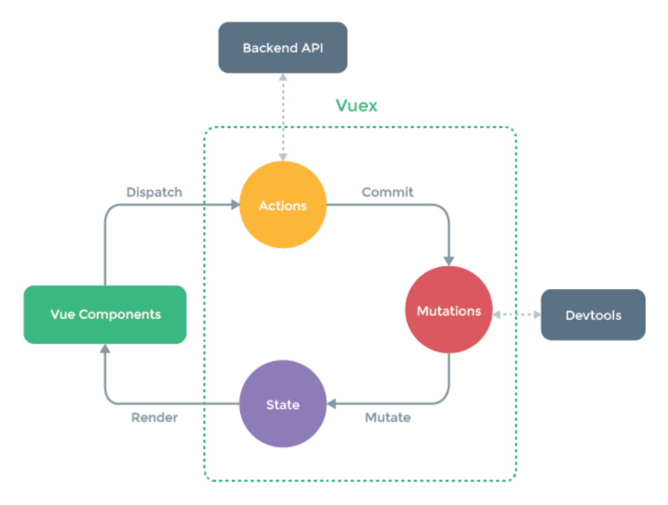

# 【项目】OJ在线判题系统

- 介绍

  OJ = Online Judge 在线判题评测系统

  用于在线评测编程题目代码的系统，能够根据用户提交的代码、出题人预先设置的题目输入输出用例，进行编译代码、运行代码、判断代码运行结果是否正确

  判题系统作为一个开放的API提供，便于开发者开放自己的OJ系统

  

- 参考

  [鱼皮笔记](https://bcdh.yuque.com/staff-wpxfif/resource/rls4he4gffa1g1ob)、[球友参考](https://www.yuque.com/eureka-ntwlf/gfkp8k/bltta3zn3i2hgl6o?singleDoc#)


## 理论知识

### 需求分析

- 描述

  用户：选择题目在线做题、编写代码提交代码

  系统：根据出题人设置答案判断用户提交是否正确

  ACM、蓝桥杯

- 科普概念

  题目给出：描述、输入输出、样例

  考察算法：时间限制、空间限制 

  - 规定模板、不能让用户随便引包、暴力遍历、内存限制时间限制 -> 安全性
  - 判题过程是异步的 -> 异步化
  - 提交后生成提交记录 (运行结果 运行信息)

  题目结果：

  - AC(Accepted 通过)、WA(Wrong Answer 答案错误)、
  - TLE(Time Limit Exceed 超时)、OLE(Output Limit Exceed 超过输出限制)、MLE(Memory Limit Exceed 超内存)、
  - RE(Runtime Error 运行时错误)、PE(Presentation Error 格式错误)、
  - CE(Compile Error 无法编译)、UKE(Unknown Error 未知错误)

  测频功能：普通测评(比对用例文件)、特殊测评(SPJ 精度误差 特判程序)、交互测评

- OJ系统的开发

  前后端：增删改查CRUD (略)

  判题系统：代码沙箱 (难点)


- 为什么做这个项目？

  网上教程比较少

  比较新颖 简历有区分度

  能学到东西：CRUD、编程思想、计算机基础、架构设计 (限制子进程内存时间)

  复杂度有点高 全程攻克

  可扩展性非常强

- 现有产品

  [leetcode](https://leetcode.cn/)、[newcoder](https://www.nowcoder.com/)、[北大poj](http://poj.org/)、[杭电oj](https://acm.hdu.edu.cn/)、[上交大oj](https://acm.sjtu.edu.cn/OnlineJudge/)、

  [hoj (java 推荐学习)](https://github.com/HimitZH/HOJ)、[青岛大学oj (python 很成熟但不好学)](https://github.com/QingdaoU/OnlineJudge)、[zoj (文档水)](https://github.com/licheng/zoj)、[voj (不完备但好学)](https://github.com/hzxie/voj)、

  [uoj (php 文档水)](https://github.com/vfleaking/uoj)、[hustoj (php 成熟但不好学)](https://github.com/hustoj/hustoj-neo)

- 核心实现

  题目浏览：CRUD

  权限校验：谁能提代码谁不能

  代码沙箱：用户提交代码藏毒、系统的资源分配 -> 沙箱 (隔离的安全的环境)、限制资源

  判题规则：题目用例的比对、结果的验证

  任务调度：服务器资源优先用户排队(有顺序的等待 而不是直接拒绝)

- 项目扩展

  > 支持多种语言
  >
  > Remote Judge
  >
  > 完善的评测功能：普通测评、特殊测评、交互测评、在线自测、子任务分组评测、文件IO
  >
  > 统计分析用户判题记录

  


### 业务流程

- 核心业务流程 (线性)

  题目模块：创建题目(管理员)、删除题目(管理员)、修改题目(管理员)、搜索题目、在线做题、提交题目代码

  用户模块：注册、登录

  判题模块：

  - 提交判题(结果是正确还是错误)、错误处理(内存溢出、安全性、超时)

  - 自主实现代码沙箱、开放接口(提供一个独立的服务)

  

- 详细业务流程 (时序图)

  判题服务：获取题目信息、预计的输入输出结果，返回给主业务后端，说明用户的答案是否正确

  代码沙箱：只负责运行代码给出结果，不管什么结果是正确的 (解耦)

  


- 技术选型

  前端：vue3、Arco Design组件库、手搓项目模板、在线代码编辑器、在线文档浏览

  后端：

  - java进程控制、java安全管理器、部分JVM知识点
  - 虚拟机(云服务器)、Docker(代码沙箱实现)
  - Spring Cloud微服务、消息队列、多种设计模式

- 架构设计 

  


### 计划和方案

- 计划

  介绍：OJ系统概念、OJ原理；项目流程、需求分析、技术选型、架构设计、主流实现方案

  前后端初始化：前端通用项目模板的搭建

  主业务流程的前后端：除代码沙箱

  自主实现代码沙箱：逐步多方案实现、安全优化

  系统优化：微服务改造、系统扩展思路


- 主流的OJ系统实现方案

  开放原则：能用别人现成的就不要自己写

  1. 现成的OJ系统：[judge0 成熟的商业产品](https://github.com/judge0/judge0) 可以用源码部署 或者公有云私有云

  2. 现成的判题API、现成的代码沙箱：[API Documentation](https://ce.judge0.com/)、[RapidAPI](https://rapidapi.com/judge0-official/api/judge0-ce) (API接口)
  3. 自主开发
  4. AI充当沙箱
  5. 移花接木：无头浏览器模拟爬虫


## 前端初始化 (模板)

- 确认环境 (切换和管理node版本工具 nvm)

  ```
  node -v  # 18 or 16
  npm -v  # 9.5.1  
  
  
  # if need 
  npm cache clean --force
  npm install -g npm@9.5.1
  
  ```

- 初始化：[vue-cli](https://cli.vuejs.org/zh/guide/) (稳定)

  ```
  cd /d/code2/java-code/
  mkdir oj-system && cd oj-system/
  
  npm install -g @vue/cli  # 脚手架工具
  vue -V  # 5.0.8
  vue create oj-frontend  # 创建项目
  
  
  # 创建项目的选项
  Vue CLI v5.0.8
  ? Please pick a preset: Manually select features
  ? Check the features needed for your project: Babel, TS, Router, Vuex, Linter
  ? Choose a version of Vue.js that you want to start the project with 3.x
  ? Use class-style component syntax? No
  ? Use Babel alongside TypeScript (required for modern mode, auto-detected polyfills, transpiling JSX)? Yes
  ? Use history mode for router? (Requires proper server setup for index fallback in production) Yes
  ? Pick a linter / formatter config: Prettier
  ? Pick additional lint features: Lint on save
  ? Where do you prefer placing config for Babel, ESLint, etc.? In dedicated config files
  ? Save this as a preset for future projects? (y/N) n
  
  
  cd oj-frontend && npm run server  # 先运行
  
  ```

  脚手架自动整合vue-router


### 前端工程化配置

- 前端工程化配置

  脚手架已配置：代码美化、自动校验、格式化插件 (无需自己配置)

  但是WebStorm的格式化和`.eslintrc.js`不适配：

  settings -> prettier -> prettier package选上、run for files`{**/*,*}.{js,ts,jsx,tsx,vue}`、on reformat code 打勾

  settings -> eslint -> automatic eslint configuration 

- 自己整合的一些参考

  [代码规范](https://eslint.org/docs/latest/use/getting-started)、[代码美化](https://prettierio/docs/en/install.html)、[直接整合](https://github.com/prettier/eslint-plugin-prettier#recommended-configuration)、[直接整合](https://github.com/prettier/eslint-config-prettier#installation)


- 引入组件

  [arco design vue组件库](https://arco.design/vue/docs/start) (字节)

  ```bash
  npm install --save-dev @arco-design/web-vue
  
  ```

  main.ts (完整引入)

  ```typescript
  import { createApp } from "vue";
  import App from "./App.vue";
  import ArcoVue from "@arco-design/web-vue";
  import "@arco-design/web-vue/dist/arco.css";
  import router from "./router";
  import store from "./store";
  
  createApp(App).use(ArcoVue).use(store).use(router).mount("#app");
  
  ```

  App.vue (验证是否成功)

  ```vue
      <a-calendar v-model="value" />
  ```

  


### 项目通用布局

- 项目通用布局

  [acro design 布局](https://arco.design/vue/component/layout)

  ```
  mkdir src/layouts
  cp src/App.vue src/layouts/BasicLayout.vue
  cp src/components/HelloWorld.vue src/components/GlobalHeader.vue
  
  ```

  App.vue

  ```vue
  <template>
    <div id="app">
      <BasicLayout />
    </div>
  </template>
  
  <style>
  #app {
  }
  </style>
  
  <script>
  import BasicLayout from "@/layouts/BasicLayout.vue";
  
  export default {
    components: { BasicLayout },
  };
  </script>
  
  ```

  BasicLayout.vue (上中下布局)

  纵压缩：顶部横条、底部横条没有始终固定 (底部footer布局优化)
  
  横压缩：未登录不要换行 (优化content globalHeader样式)
  
  ```vue
  <template>
    <div id="basicLayout">
      <a-layout style="min-height: 100vh">
        <a-layout-header class="header">
          <GlobalHeader />
        </a-layout-header>
  
        <a-layout-content class="content">
          <router-view />
        </a-layout-content>
  
        <a-layout-footer class="footer">
          <a href="http://github.com/Time1043" target="_blank">Time1043 周坚深</a>
        </a-layout-footer>
      </a-layout>
    </div>
  </template>
  
  <style scoped>
  #basicLayout .header {
    margin-bottom: 16px;
    box-shadow: #eee 1px 1px 5px;
  }
  
  #basicLayout .content {
    background: linear-gradient(to right, #bbb, #fff);
    margin-bottom: 16px;
    padding: 20px;
  }
  
  #basicLayout .footer {
    background: #efefef;
    padding: 16px;
    position: sticky;
    bottom: 0;
    left: 0;
    right: 0;
    text-align: center;
  }
  </style>
  
  <script setup lang="ts">
  import GlobalHeader from "@/components/GlobalHeader.vue";
  </script>
  
  ```
  
  GlobalHeader.vue (封装组件) 
  
  - 点击菜单项 -> 跳转更新路由 -> 更新路由后同步更新菜单栏的高亮状态
  
    点击菜单项后跳转：点击路由跳转对应页面 (菜单组件读取路由 动态渲染菜单项 绑定跳转事件)
  
    刷新后要选中之前：根据当前页面激活状态 (同步路由到菜单项)
  
  - 登录信息
  
    [栅格布局](https://arco.design/vue/component/grid#grid)
  
    获取状态变量 `store.state.user.loginUser?.userName`
  
    修改状态变量：调用actions -> mutations -> state `store.dispatch("user/getLoginUser", { userName: "yz" });`
  
  ```vue
  <template>
    <a-row id="globalHeader" align="center" :wrap="false">
      <a-col flex="auto">
        <a-menu
          mode="horizontal"
          :selected-keys="selectedKeys"
          @menu-item-click="doMenuClick"
        >
          <a-menu-item
            key="0"
            :style="{ padding: 0, marginRight: '38px' }"
            disabled
          >
            <div class="title-bar">
              
              <div class="title">时oj</div>
            </div>
          </a-menu-item>
          <a-menu-item v-for="item in visibleRoutes" :key="item.path">
            {{ item.name }}
          </a-menu-item>
        </a-menu>
      </a-col>
  
      <a-col flex="100px">
        <div>{{ loginUse?.userName ?? "未登录" }}</div>
      </a-col>
    </a-row>
  </template>
  
  <script setup lang="ts">
  import { routes } from "@/router/routes";
  import { useRoute, useRouter } from "vue-router";
  import { computed, ref } from "vue";
  import { useStore } from "vuex";
  import checkAccess from "@/access/checkAccess";
  import AccessEnum from "@/access/accessEnum";
  
  const router = useRouter();
  const route = useRoute();
  const store = useStore(); // 状态信息管理
  const loginUse = store.state.user.loginUser; // 当前用户
  const selectedKeys = ref([route.path]); // 默认选中首页
  
  // 路由跳转后 更新选中的菜单项
  router.afterEach((to, from, failure) => {
    selectedKeys.value = [to.path];
  });
  
  const doMenuClick = (key: string) => {
    router.push({ path: key });
  };
  
  // todo 修改状态信息
  // setTimeout(() => {
  //   store.dispatch("user/getLoginUser", {
  //     userName: "yingzhu",
  //     userRole: AccessEnum.ADMIN,
  //   });
  // }, 3000);
  
  // 控制路由的显隐 展示在菜单的路由数组
  const visibleRoutes = computed(() => {
    return routes.filter((item, index) => {
      if (item.meta?.hideInMenu) {
        return false;
      }
      // todo 根据权限过滤菜单
      if (!checkAccess(loginUse, item?.meta?.access as string)) {
        return false;
      }
      return true;
    });
  });
  </script>
  
  <style scoped>
  .title-bar {
    display: flex;
    align-items: center;
  }
  
  .title {
    color: #444;
    margin-left: 16px;
  }
  
  .logo {
    height: 48px;
  }
  </style>
  
  ```
  
  router\index.ts (参数抽出来 喂给菜单)
  
  ```typescript
  import { createRouter, createWebHistory } from "vue-router";
  import { routes } from "@/router/routes";
  
  const router = createRouter({
    history: createWebHistory(process.env.BASE_URL),
    routes,
  });
  
  export default router;
  ```
  
  router\routes.ts (通用路由菜单)
  
  ```typescript
  import { RouteRecordRaw } from "vue-router";
  import HomeView from "@/views/HomeView.vue";
  import AdminView from "@/views/AdminView.vue";
  import NoAuthView from "@/views/NoAuthView.vue";
  import ACCESS_ENUM from "@/access/accessEnum";
  import UserLayout from "@/layouts/UserLayout.vue";
  import UserLoginView from "@/views/user/UserLoginView.vue";
  import UserRegisterView from "@/views/user/UserRegisterView.vue";
  
  export const routes: Array<RouteRecordRaw> = [
    {
      path: "/user",
      name: "用户",
      component: UserLayout,
      children: [
        {
          path: "/user/login",
          name: "用户登录",
          component: UserLoginView,
        },
        {
          path: "/user/register",
          name: "用户注册",
          component: UserRegisterView,
        },
      ],
      meta: {
        hideInMenu: true,
      },
    },
    {
      path: "/",
      name: "浏览题目",
      component: HomeView,
    },
    {
      path: "/hide",
      name: "隐藏页面",
      component: HomeView,
      meta: {
        hideInMenu: true,
      },
    },
    {
      path: "/admin",
      name: "管理员页面",
      component: AdminView,
      meta: {
        access: ACCESS_ENUM.ADMIN,
      },
    },
    {
      path: "/noAuth",
      name: "无权限",
      component: NoAuthView,
    },
    {
      path: "/about",
      name: "关于我的",
      // route level code-splitting
      // this generates a separate chunk (about.[hash].js) for this route
      // which is lazy-loaded when the route is visited.
      component: () =>
        import(/* webpackChunkName: "about" */ "../views/AboutView.vue"),
    },
  ];
  
  ```
  
  

### 全局状态管理

- 全局状态管理 [vuex](https://vuex.vuejs.org/) 

  所有页面全局共享的变量 而不是局限在一个页面 (本质上是增删改查全局变量API 再多点功能)

  用户登录态存放、权限检验

  

- [modules](https://vuex.vuejs.org/zh/guide/modules.html)、[购物车示例](https://github.com/vuejs/vuex/tree/4.0/examples/classic/shopping-cart)

  ```
  touch src/store/user.ts
  
  ```

- 知识总结

  state：存储的状态信息 (如用户信息)

  mutation (尽量同步)：定义了变量进行增删改的方法

  actions (支持异步)：执行异步操作，并且触发mutation的更改 (actions调用mutation)

- 代码实现

  store\index.ts

  ```typescript
  import { createStore } from "vuex";
  import user from "./user";
  
  export default createStore({
    mutations: {},
    actions: {},
    modules: {
      user,
    },
  });
  ```

  store\user.ts (先定义user模块)

  ```typescript
  // initial state
  import { StoreOptions } from "vuex";
  import AccessEnum from "@/access/accessEnum";
  
  export default {
    namespaced: true,
    state: () => ({
      loginUser: {
        userName: "未登录",
        userRole: AccessEnum.NOT_LOGIN,
      },
    }),
    actions: {
      getLoginUser({ commit, state }, payload) {
        // todo 从远程请求获取登录信息 不要写死
        commit("updateUser", payload);
      },
    },
    mutations: {
      updateUser(state, payload) {
        state.loginUser = payload;
      },
    },
  } as StoreOptions<any>;
  
  ```
  
  
  


### 权限管理

- 权限管理

  以一套通用的机制，去定义哪个页面需要哪些权限 (路由中定义权限)
  
  ```
  cp src/views/HomeView.vue src/views/AdminView.vue
  cp src/views/HomeView.vue src/views/NoAuthView.vue
  
  ```
  
- 思路：
  
  在路由配置文件中，定义某个路由的访问权限
  
  在全局页面组件中，绑定一个全局路由监听。每次访问页面时，根据用户要访问页面的路由信息，先判断用户是否对应的访问权限
  
  如果没有，拦截或跳转401鉴权或登录页
  
- 代码实现
  
  router\routes.ts (`canAdmin`)
  
  App.vue (全局的路由拦截 预留一个可以全局初始化的逻辑)
  
  ```vue
  <template>
    <div id="app">
      <BasicLayout />
    </div>
  </template>
  
  <style>
  #app {
  }
  </style>
  
  <script setup lang="ts">
  import BasicLayout from "@/layouts/BasicLayout.vue";
  import { useRouter } from "vue-router";
  import { useStore } from "vuex";
  import { onMounted } from "vue";
  
  /**
   * 全局初始化函数，全局单次调用的代码
   */
  const doInit = () => {
    // todo 初始化函数
    console.log("hello shiOJ welcome");
  };
  
  onMounted(() => {
    doInit();
  });
  
  const router = useRouter();
  const store = useStore();
  
  router.beforeEach((to, from, next) => {
    // 能够监听到路由信息 且有权限信息
    if (to.meta?.access === "canAdmin") {
      // 该页面需要管理员权限
      if (store.state.user.loginUser?.role !== "admin") {
        // 当前用户不是管理员
        next("/noAuth");
        return;
      }
    }
    next();
  });
  </script>
  
  ```
  
- 根据配置控制菜单显隐
  
  实现：
  
  给路由新增一个标志位 用于判断路由是否显隐 `meta hideInMenu` (routes.ts)
  
  在view中v-for、v-if条件渲染 (不规范 不推荐 性能浪费)
  
  在js中先过滤 `visibleRoutes` (GlobalHeader.vue)
  
- 根据权限隐藏菜单
  
  类似 (后面实现)
  
  


- 全局权限管理

  ```bash
  cd /d/code2/java-code/oj-system2/oj-frontend/
  mkdir src/access
  touch src/access/accessEnum.ts
  touch src/access/checkAccess.ts
  
  ```

  定义权限

  定义一个公用的权限检验方法 (菜单组件要用 权限拦截要用 抽离成公共方法)

  修改GlobalHeader.vue动态菜单组件，根据权限来过滤菜单 (计算属性 没解决)

  access\accessEnum.ts

  ```typescript
  /**
   * 权限定义
   */
  const ACCESS_ENUM = {
    NOT_LOGIN: "notLogin",
    USER: "user",
    ADMIN: "admin",
  };
  
  export default ACCESS_ENUM;
  ```

  access\checkAccess.ts

  ```typescript
  import ACCESS_ENUM from "@/access/accessEnum";
  
  /**
   * 检查权限
   * @param loginUser 当前登录用户
   * @param needAccess 需要有的权限 (默认值是未登录)
   * @returns boolean 是否有权限
   */
  const checkAccess = (loginUser: any, needAccess = ACCESS_ENUM.NOT_LOGIN) => {
    // 获取当前用户的权限 如果没有则未登录
    const loginUserAccess = loginUser?.userRole ?? ACCESS_ENUM.NOT_LOGIN;
  
    // 未登录用户可以访问的页面 放行
    if (needAccess === ACCESS_ENUM.NOT_LOGIN) {
      return true;
    }
  
    // 需要用户登录才能访问的页面
    if (needAccess === ACCESS_ENUM.USER) {
      // 如果用户未登录 则无权限
      if (loginUserAccess === ACCESS_ENUM.NOT_LOGIN) {
        return false;
      }
    }
  
    // 需要管理员权限才能访问的页面
    if (needAccess === ACCESS_ENUM.ADMIN) {
      // 如果用户不是管理员 则无权限
      if (loginUserAccess !== ACCESS_ENUM.ADMIN) {
        return false;
      }
    }
    return true; // 有权限 放行
  };
  
  export default checkAccess;
  
  ```

  


- 前端代码自动生成 (通用的代码生成插件)

  后续


## 后端初始化 (轮子)

### 后端项目初始化

- 拉取

  ```bash
  cd /d/code2/java-code
  git clone http://gitlab.code-nav.cn/root/springboot-init.git
  cd springboot-init/ && rm -rf .git && cd ..
  cp -r springboot-init/ oj-system2/java-oj-backend/
  
  mysql -uroot -p123456
  create database java_oj;
  
  ```
  
  全局替换：`springboot-init` -> `java-oj-backend`
  
  全局替换：`springbootinit` -> `javaoj` (包名替换：`com.time1043.javaoj`)
  
  application.yml
  
  ```yml
      
      url: jdbc:mysql://localhost:3306/java_oj
  
    port: 8121
  
  ```
  
  sql\create_table.sql (创建数据库数据表)
  
  ```sql
  
  create database if not exists java_oj;
  
  use java_oj;
  
  ```
  
  MainApplication 启动
  
  http://localhost:8121/api/doc.html (测接口 userRegister userLogin)
  
  [接口文档地址](http://localhost:8121/api/v2/api-docs) (后面自动生成要用)
  
  


### 后端项目结构

- 初始化项目结构

  `README.md`

  `sql\create_table.sql` 定义了数据库的初始化建库建表语句

  `sql\post_es_mapping.json` 帖子表再ES中的建表语句

  `Dockerfile` 用于构建Docker镜像

  src

  `MainApplication` 项目启动入口

  `model` 数据模型、实体类、包装类、枚举值

  `controller` 接收请求

  `service` 业务层，用于编写业务逻辑

  `manager` 服务层，定义一些公用的服务、对接第三方API等

  `mapper` mybatis的数据访问层，用于操作数据库

  src

  `annotation` 定义注解 (权限校验)

  `aop` 用于全局权限校验、全局日志记录

  `common` 万用的类 (如通用响应类)

  `config` 用于接收application.yml中的参数，初始化一些客户端的配置类 (如对象存储客户端)

  `constant` 定义常量

  `esdao` 类似与mybatis的mapper，用于操作ES

  `exception` 异常处理相关

  `job` 任务相关 (定时任务 单次任务)

  `utils` 工具类，各种各样的公用方法

  `wxmp` 公众号相关的包

  `test` 单元测试

  


### 前后端联调 (跑通)

- 前后端是怎么连起来的？接口、请求

  前端发送请求调用后端接口

- 实现：[请求工具类 axios github](https://github.com/axios/axios)、[axios Getting Started](https://axios-http.com/docs/intro)

  ```bash
  cd /d/code2/java-code/oj-system2/oj-frontend
  npm install axios
  
  ```

  传统调用：每个请求单独编写代码 (至少得写请求路径)

  自动生成：[openapi-typescript-codegen](https://github.com/ferdikoomen/openapi-typescript-codegen) (示例)

  ```bash
  npm install openapi-typescript-codegen --save-dev
  openapi --input http://localhost:8121/api/v2/api-docs --output ./generated --client axios
  
  ```

- 需要改url方案一：[OpenAPI object](https://github.com/ferdikoomen/openapi-typescript-codegen/wiki/OpenAPI-object)
  
  generated\core\OpenAPI.ts (全局参数修改对象)
  
  ```typescript
  
  export const OpenAPI: OpenAPIConfig = {
      BASE: 'http://localhost:8121',
      VERSION: '1.0',
      WITH_CREDENTIALS: true,
      CREDENTIALS: 'include',
      TOKEN: undefined,
      USERNAME: undefined,
      PASSWORD: undefined,
      HEADERS: undefined,
      ENCODE_PATH: undefined,
  };
  
  ```
  
- 需要改url方案二：[axios Interceptors 全局请求响应拦截器](https://axios-http.com/docs/config_defaults)
  
  ```bash
  mkdir src/plugins
  touch src/plugins/axios.ts
  
  ```
  
  plugins\axios.ts (粘贴demo)
  
  main.ts (引入axios.ts)
  
  ```typescript
  import "@/plugins/axios";
  ```
  
  


- 对接接口：用户登录

  store\user.ts

  ```typescript
  // initial state
  import { StoreOptions } from "vuex";
  import AccessEnum from "@/access/accessEnum";
  import { UserControllerService } from "../../generated";
  
  export default {
    namespaced: true,
    state: () => ({
      loginUser: {
        userName: "未登录",
      },
    }),
    actions: {
      async getLoginUser({ commit, state }, payload) {
        // 从远程请求获取用户信息
        const res = await UserControllerService.getLoginUserUsingGet();
        if (res.code === 0) {
          commit("updateUser", res.data);
        } else {
          commit("updateUser", {
            ...state.loginUser,
            userRole: AccessEnum.NOT_LOGIN,
          });
        }
      },
    },
    mutations: {
      updateUser(state, payload) {
        state.loginUser = payload;
      },
    },
  } as StoreOptions<any>;
  ```
  
  遇到问题：http://localhost:8121/api/api/user/get/login
  
  


- 用户登录功能打通

  自动登录：刚进入页面就触发登录

  1. 从远程请求获取用户信息 (store\user.ts)

  2. 触发getLoginUser函数：多种选择 (路由拦截、全局页面入口、全局通用布局、权限管理✔)

  ```bash
  touch src/access/index.ts
  
  ```

  App.vue (移除权限管理部分)

  access\index.ts (专注全局权限管理 只要不引入就不开启) (router直接从文件引入)

  ```typescript
  import router from "@/router";
  import store from "@/store";
  import ACCESS_ENUM from "@/access/accessEnum";
  import checkAccess from "@/access/checkAccess";
  
  router.beforeEach(async (to, from, next) => {
    console.log("登录用户信息：", store.state.user.loginUser);
  
    const loginUser = store.state.user.loginUser;
    // loginUser不存在 或 userRole不存在(还未触发登录) 则自动登录
    if (!loginUser || !loginUser.userRole) {
      // await 等用户登录成功后再执行路由跳转
      await store.dispatch("user/getLoginUser");
    }
  
    // 要去页面的权限
    const needAccess = (to.meta.access as string) ?? ACCESS_ENUM.NOT_LOGIN;
    // 如果用户访问的页面需要登录 强制跳转登录页面
    if (needAccess !== ACCESS_ENUM.NOT_LOGIN) {
      // 如果没登陆 强制跳转登录页面
      if (!loginUser || !loginUser.userRole) {
        next(`/user/login?redirect=${to.fullPath}`);
        return;
      }
      // 如果登陆了 则判断用户权限
      if (!checkAccess(loginUser, needAccess)) {
        next("/noAuth");
        return;
      }
    }
  
    next();
  });
  
  ```

  main.ts (引入 执行)

  ```typescript
  import "@/access";
  ```

  http://localhost:8080/user/login?redirect=/admin

  


- 登录页面

  不用复用导航栏 (支持多套布局)

- 代码实现

  ```bash
  cp src/layouts/BasicLayout.vue src/layouts/UserLayout.vue  # 布局
  mkdir src/views/user  # 页面
  cp src/views/AboutView.vue src/views/user/UserLoginView.vue
  cp src/views/AboutView.vue src/views/user/UserRegisterView.vue
  
  ```
  
  App.vue (区分布局)
  
  ```vue
  <template>
    <div id="app">
      <template v-if="route.path.startsWith('/user')">
        <router-view></router-view>
      </template>
  
      <template v-else>
        <BasicLayout />
      </template>
    </div>
  </template>
  
  
  ```
  
  routes.ts (注册路由)
  
- 新建布局和页面
  
  UserLayout.vue
  
  ```vue
  <template>
    <div id="userLayout">
      <a-layout style="min-height: 100vh">
        <a-layout-header class="header">
          <a-space>
            
            <div style="margin-left: 16px; font-size: 24px; font-weight: bold">
              时oj
            </div>
          </a-space>
        </a-layout-header>
  
        <a-layout-content class="content">
          <router-view />
        </a-layout-content>
  
        <a-layout-footer class="footer">
          <a href="http://github.com/Time1043" target="_blank">Time1043 周坚深</a>
        </a-layout-footer>
      </a-layout>
    </div>
  </template>
  
  <style scoped>
  #userLayout {
    text-align: center;
    background: url("https://gw.alipayobjects.com/zos/rmsportal/FfdJeJRQWjEeGTpqgBKj.png");
  }
  
  #userLayout .logo {
    height: 48px;
  }
  
  #userLayout .header {
    margin-top: 16px;
  }
  
  #userLayout .content {
    margin-bottom: 16px;
    padding: 20px;
  }
  
  #userLayout .footer {
    padding: 16px;
    position: sticky;
    bottom: 0;
    left: 0;
    right: 0;
    text-align: center;
  }
  </style>
  
  <script></script>
  
  ```
  
  UserLoginView.vue (先写死 后改成向后端发请求) [form](https://arco.design/vue/component/form) [全局message](https://arco.design/vue/component/message)
  
  ```vue
  <template>
    <div id="userLoginView">
      <h2 style="margin-bottom: 16px">welcome to user login</h2>
  
      <a-form
        style="max-width: 480px; margin: 0 auto"
        label-align="left"
        auto-label-width
        :model="form"
        @submit="handleSubmit"
      >
        <a-form-item field="userAccount" label="账号">
          <a-input v-model="form.userAccount" placeholder="请输入账号..." />
        </a-form-item>
        <a-form-item field="userPassword" tooltip="密码不少于8位" label="密码">
          <a-input-password
            v-model="form.userPassword"
            placeholder="请输入密码..."
          />
        </a-form-item>
        <a-form-item>
          <a-button type="primary" style="width: 120px" html-type="submit"
            >登录
          </a-button>
        </a-form-item>
      </a-form>
    </div>
  </template>
  
  <script setup lang="ts">
  import { reactive } from "vue";
  import { UserControllerService } from "../../../generated";
  import message from "@arco-design/web-vue/es/message";
  import { useRouter } from "vue-router";
  import { useStore } from "vuex";
  
  /**
   * 表单数据
   */
  const form = reactive({
    userAccount: "",
    userPassword: "",
  });
  
  const router = useRouter();
  const store = useStore();
  
  /**
   * 提交表单事件
   * @param data
   */
  const handleSubmit = async (data: any) => {
    const res = await UserControllerService.userLoginUsingPost(form);
    if (res.code === 0) {
      // 登录成功跳转到首页 (有重定向的url)
      await store.dispatch("user/getLoginUser");
      router.push({ path: "/", replace: true });
    } else {
      message.error("登录失败：" + res.message);
    }
  };
  </script>
  
  ```
  
  登录成功后要修改页面的状态  store\user.ts getLoginUser
  
  


- 遇到报错

  ```
  D:\systemEnvironment\nodejs\npm.cmd run serve
  
  > oj-frontend@0.1.0 serve
  > vue-cli-service serve
  
   ERROR  Error loading vue.config.js:
   ERROR  TypeError: defineConfig is not a function
  TypeError: defineConfig is not a function
      at Object.<anonymous> (D:\code2\java-code\oj-system2\oj-frontend\vue.config.js:2:18)
      at Module._compile (node:internal/modules/cjs/loader:1356:14)
      at Module._extensions..js (node:internal/modules/cjs/loader:1414:10)
      at Module.load (node:internal/modules/cjs/loader:1197:32)
      at Module._load (node:internal/modules/cjs/loader:1013:12)
      at Module.require (node:internal/modules/cjs/loader:1225:19)
      at require (node:internal/modules/helpers:177:18)
      at Service.loadUserOptions (D:\code2\java-code\oj-system2\oj-frontend\node_modules\@vue\cli-service\lib\Service.js:316:22)
      at Service.init (D:\code2\java-code\oj-system2\oj-frontend\node_modules\@vue\cli-service\lib\Service.js:75:30)
      at Service.run (D:\code2\java-code\oj-system2\oj-frontend\node_modules\@vue\cli-service\lib\Service.js:221:10)
  
  Process finished with exit code 1
  
  ```

  解决

  ```bash
  vue upgrade
  
  ```

  


## 后端接口开发

- 主业务流程开发

  系统功能梳理：用户模块、题目模块、判题模块

  库表设计：用户表、题目表题目提交表

  后端接口开发：

  前端页面开发：

  


- 系统功能梳理

  用户模块：注册、登录 ✔

  题目模块：

  - admin：创建题目、删除题目、修改题目 
  - 用户：搜索题目、在线做题/题目详情页 

  判题模块：

  - 提交判题：结果是否正确
  - 错误处理：内存溢出、安全性、超时
  - 自主实现：**代码沙箱**
  - 开放接口：提供一个独立的服务


### 库表设计 (题目模块)

- 库表设计

  **动静分离**


- 用户表 (轮子有)

- 题目表 (看别人的系统 GPT)

  基础字段：

  - 标题 `title`、内容 `content`、分类标签 `tag`(栈 队列 链表 简单 中等 困难 - JSON数组字符串)、题目答案 `answer`(管理员采纳用户)、

  - 提交数 `submitNum`、通过数 `acceptedNum` (通过两个比率动态计算出难度标签 便于统计分析)

  判题字段：`judgeConfig` (json对象)

  - 时间限制、内存限制 

    ```json
    {
        "timeLimit": 1000,
        "memoryLimit": 1000,
        "stackLimit": 1000
    }
    ```

  判题字段：`judgeCase` (json数组)

  - 输入用例、输出用例 (一一对应)

    ```json
    [
        {
            "input": "1 2",
            "output": "3 4"
        },
        {
            "input": "5 6",
            "output": "7 8"
        }
    ]
    ```

- 题目提交表

  提交用户id `userId`、题目id `questionId`、语言 `language`、用户的代码 `code`、判题状态 `status`(0待判题 1判题中 2成功 3失败)

  判题信息 `judgeInfo`(json对象 判题过程中得到的一些信息 比如程序的失败原因 程序执行消耗的时间空间)

  ```json
  {
      "message": "程序执行信息",
      "time": 1000,  // 单位为ms
      "memory": 1000,  // 单位为kb
  }
  ```

  判题信息枚举值 message：

  Accepted 成功、Wrong Answer 答案错误、Compile Error 编译错误、Memory Limit Exceeded 内存溢出、

  Time Limit Exceeded 超时、Presentation Error 展示错误、Output Limit Exceeded 输出溢出、Waiting 等待中、

  Dangerous Operation 危险操作、Runtime Error 运行错误(用户程序的问题)、System Error 系统错误(做系统人的问题)

- 建表语句

  ```sql
  -- 题目表
  create table if not exists question
  (
      id          bigint auto_increment comment 'id' primary key,
      title       varchar(512)                       null comment '标题',
      content     text                               null comment '内容',
      tags        varchar(1024)                      null comment '标签列表（json 数组）',
      answer      text                               null comment '题解',
      submitNum   int      default 0                 not null comment '提交数',
      acceptedNum int      default 0                 not null comment '通过数',
      judgeCase   text                               null comment '判题用例（json 数组）',
      judgeConfig text                               null comment '判题配置（json 对象）',
      thumbNum    int      default 0                 not null comment '点赞数',
      favourNum   int      default 0                 not null comment '收藏数',
      userId      bigint                             not null comment '创建用户 id',
      createTime  datetime default CURRENT_TIMESTAMP not null comment '创建时间',
      updateTime  datetime default CURRENT_TIMESTAMP not null on update CURRENT_TIMESTAMP comment '更新时间',
      isDelete    tinyint  default 0                 not null comment '是否删除',
      index idx_userId (userId)
  ) comment '题目' collate = utf8mb4_unicode_ci;
  
  -- 题目提交表
  create table if not exists question_submit
  (
      id         bigint auto_increment comment 'id' primary key,
      language   varchar(128)                       not null comment '编程语言',
      code       text                               not null comment '用户代码',
      judgeInfo  text                               null comment '判题信息（json 对象）',
      status     int      default 0                 not null comment '状态：0-等待判题，1-正在判题，2-判题完成，3-判题失败',
      questionId bigint                             not null comment '题目 id',
      userId     bigint                             not null comment '创建用户 id',
      createTime datetime default CURRENT_TIMESTAMP not null comment '创建时间',
      updateTime datetime default CURRENT_TIMESTAMP not null on update CURRENT_TIMESTAMP comment '更新时间',
      isDelete   tinyint  default 0                 not null comment '是否删除',
      index idx_questionId (questionId),
      index idx_userId (userId)
  ) comment '题目提交';
  ```
  
  


- 字段设计

- 存JSON的前提

  不需要根据某个字段去倒查这条数据

  字段含义相关，属于同一类的值

  字段存储空间占用不能太大

  (优势：便于扩展 只需要改变对象内部的字段 而不用修改数据库表)

- 数据库的文件存储

  若文件较小，可以直接存到数据库

  若文件>512k，则单独存放，数据库只保存文件url (否则数据库查询很慢 类似存储用户头像)
  
- 数据库索引 when which

  单个索引、联合索引

  从实际的查询语句、字段枚举值的区分度、字段的类型考虑(where 条件指定的字段)

  ```
  如：where userld=1 and questionld =2
  可以选择根据 userld 和 questionld 分别建立索引(需要分别根据这两个字段单独查询); 也可以选择给这两个字段建立联合索引(所查询的字段是绑定在一起的)
  
  原则上能不用索引就不用索引; 能用单个索引就别用联合/多个索引; 不要给没区分度的字段加索引(比如性别，就男/女)。
  因为索引也是要占用空间的。
  
  ```

  


### 后端接口 (题目模块)

- 后端开发流程

  根据功能设计库表

  自动生成 对数据库的增删改查 (mapper service) -> 代码生成器 [sql-father](http://sqlfather.yupi.icu/)

  编写 controller 层，实现基本的增删改查和权限校验 -> 代码生成器 

  根据业务订制开发新的功能，编写新的代码

  

- 对数据库的增删改查 (mapper service)

  MyBatisX 生成：MyBatisX-Generator -> module path -> annotation (MyBatis-Plus3) options (comment lombok actualColumn Model) template (mybatis-plus3)

  移动生成的代码：要重构否则包名报错


- 编写 controller 层 (基于模板)

  单表(静)、关联表(动)

  题目类比帖子、题目提交类比帖子点赞

  ```
  cd  /d/code2/java-code/oj-system2/java-oj-backend/
  cp src/main/java/com/time1043/javaoj/controller/PostController.java src/main/java/com/time1043/javaoj/controller/QuestionController.java
  cp src/main/java/com/time1043/javaoj/controller/PostThumbController.java src/main/java/com/time1043/javaoj/controller/QuestionSubmitController.java
  
  mkdir src/main/java/com/time1043/javaoj/model/dto/question
  cp src/main/java/com/time1043/javaoj/model/dto/post/PostAddRequest.java src/main/java/com/time1043/javaoj/model/dto/question/QuestionAddRequest.java
  cp src/main/java/com/time1043/javaoj/model/dto/post/PostEditRequest.java src/main/java/com/time1043/javaoj/model/dto/question/QuestionEditRequest.java
  cp src/main/java/com/time1043/javaoj/model/dto/post/PostQueryRequest.java src/main/java/com/time1043/javaoj/model/dto/question/QuestionQueryRequest.java
  cp src/main/java/com/time1043/javaoj/model/dto/post/PostUpdateRequest.java src/main/java/com/time1043/javaoj/model/dto/question/QuestionUpdateRequest.java
  
  touch src/main/java/com/time1043/javaoj/model/dto/question/JudgeCase.java
  touch src/main/java/com/time1043/javaoj/model/dto/question/JudgeConfig.java
  
  mkdir src/main/java/com/time1043/javaoj/model/dto/questionsubmit
  touch src/main/java/com/time1043/javaoj/model/dto/question/JudgeInfo.java
  
  touch src/main/java/com/time1043/javaoj/model/vo/QuestionVO.java  # 返回给前端的 (节约网络传输大小 过滤字段或脱敏 保证安全性)
  
  ```

  全局替换 (指定大小写)

  `post` -> `question`、`Post` -> `Question`、`帖子` -> `题目`、`QuestionMapping` -> `PostMapping`

  `post_thumb` -> `question_submit`、`postThumb` -> `questionSubmit`、`PostThumb` -> `QuestionSubmit`、`帖子点赞` -> `题目提交`


- 根据实体类编写封装的对象 (DTO VO 枚举值字段 - 用于接受前端请求 或业务间传递消息)

  复制文件、替换名字；字段编写(实体类复制 删除不要的)

  updateRequest 和 editRequest 的区别：前者是给管理员更新用的，可以指定更多字段；后者是给普通用户试用的，只能指定部分字段。


- 根据json创建对象

  为了更方便地处理 json 字段中的某个字段，需要给对应的json 字段编写独立的类，比如 judgeConfig、judgeInfo、judgeCase

  什么情况下要加业务前缀？什么情况下不加？加业务前缀的好处，防止多个表都有类似的类，产生冲突；不加的前提，因为可能这个类是多个业务之间共享的能够复用的。

  D:\code2\java-code\oj-system2\java-oj-backend\src\main\java\com\time1043\javaoj\model\dto\question\JudgeCase.java

  D:\code2\java-code\oj-system2\java-oj-backend\src\main\java\com\time1043\javaoj\model\dto\question\JudgeConfig.java

  D:\code2\java-code\oj-system2\java-oj-backend\src\main\java\com\time1043\javaoj\model\dto\questionsubmit\JudgeInfo.java


## 前端页面开发


## 判题机模块架构


## 前置：本地虚拟linux

- 问题：安装docker

  win：wsl、docker

  win：vmware、[ubuntu1804 desk](https://releases.ubuntu.com/bionic/)

- vmware新建虚拟机：……

- 初始化配置

  屏幕分辨率：win -> resolution -> 200% 

  中文语言：win -> language -> install -> install / remove languages -> chinese(simplified) -> 语言列表汉语拖到最上 -> apply system-wide

  中文输入法：win -> language -> 输入源 + 

  日期时间：win -> time -> shanghai

  屏幕常亮：setting -> 

- 两种安装软件的方式：应用商城、包管理器 (ctl alt t)

  ```bash
  sudo apt install docker.io
  docker -v
  sudo docker run hello-world
  
  
  # 远程开发 ip
  sudo apt install net-tools
  ifconfig  # 192.168.64.135
  # 远程开发 ssh
  sudo apt-get install openssh-server
  ps -ef | grep ssh
  
  # java
  sudo apt update
  sudo apt install openjdk-8-jdk
  java -verison
  # maven
  sudo apt install maven
  mvn -v
  
  ```

  

- linux环境编写代码

  远程开发：在win上操作linux

- 方式1：远程部署 (文件同步)

  ssh连接：win idea：tools -> deployment -> configuration -> + -> sftp -> ubuntu1804(输入服务器名称) -> ssh config

  文件同步：

  win操作linux运行项目：terminal

  ```bash
  cd code2/code-java
  mvn spring-boot:run
  mvn package
  java -jar /home/yingzhu/code2/code-java/target/user-center-java-0.0.1-SNAPSHOT.jar --spring.profiles.active=prod
  
  
  ```

  

- 方式2：纯远程开发


## 代码沙箱原生实现


## 代码沙箱docker实现


## 从单点登录改造成微服务


## 简历写法


